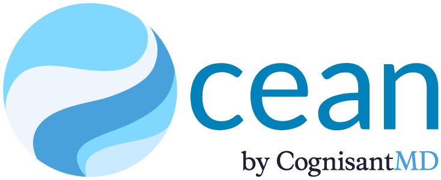
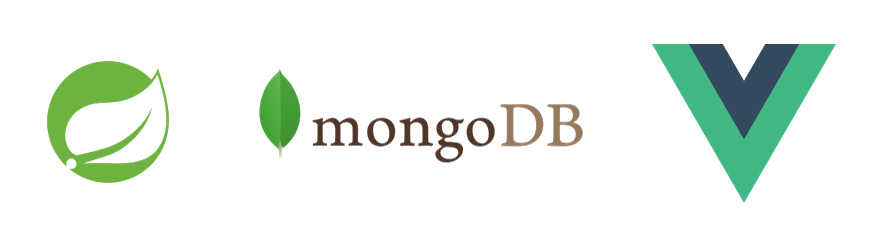

# Software in Healthcare - My Co-op Experience with CognisantMD.
_September 9, 2022_

## Introduction
This blog post is dedicated to my summer, co-op internship at CognisantMD - a leading provider of EMR-integrated patient engagement solutions based in Toronto, ON. I functioned as part of the Developer team as a Software Engineer, working under the ever-so accomplished director of R&D, Jonathan Fishbein.

## About CognisantMD
CognisantMD is committed to improving healthcare through its cloud-based platform, Ocean. This product allows patients and healthcare providers to securely share health information for clinical use, administration, referrals, and research. By adding Ocean Tablets, Ocean Online Messages, and their large library of forms and patient questionnaires to existing Electronic Medical Records, the Ocean Platform provides a powerful way to digitally connect patients, primary care, specialists, and more.

## Job Description
As a Software Engineer, I worked on full-stack features for their Ocean Platform using Vue and Java Spring. This included designing, developing, collaborating, and testing the feature throughout our three-week sprints. Projects were nothing short of exciting, with every task presenting a new challenge and room to improve my skills. Of the many assignments, the one I enjoyed, in particular, was our collaborated development of the FHIR API: a standard for exchanging healthcare information. 

Impact and influence is something that many organisations strive for; CognisantMD was no different. Interning here exposed me to new design patterns, technology, and innovation. I practiced peer-review, test automation, and pair-programming alongside several dedicated, hilarious, and clever developers. 

---
## **Summer 2022 Goals**

### Improve my understanding of Java Spring and MongoDB

-	I challenged myself to learn new technology through attempting Spring tickets and discussing any bumps with my co-workers. This allowed me to learn more than just what I required to design a solution, but rather what was needed to find and build efficient solutions. By the end of the learning phase, I found myself comfortable using newfound technology, knowing what to look for and being able to research what was neeeded to implement it.

### Gain experience using Vue.js

- Through tutorials, blogs and the input of my team, I was able to pick up Vue and write professional code when assigned tasks regarding web development. With this experience, I can confidently say that I can read, write, and understand Vue code.

### Adopt an agile software development cycle

- During this internship, I participated in discussions with several engineers who think and approach their issues differently, highlighting their pros and cons and working to find optimal approaches to their assignments. I quickly became comfortable with the agile software development cycle, which has taught me that there is always room for improvement and that issues are always resolvable.

## Conclusion

## Acknowledgments

